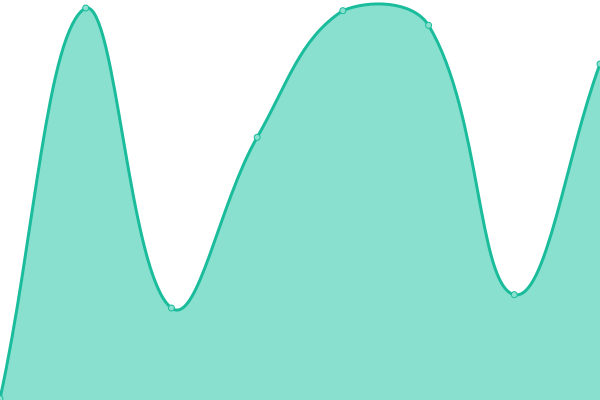
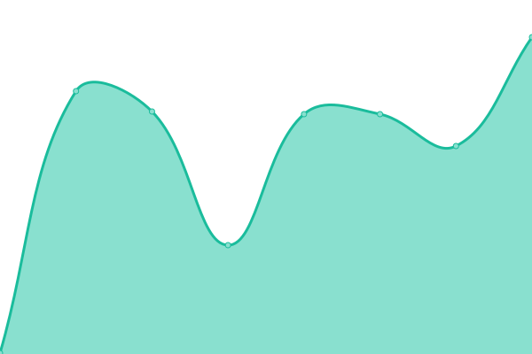

# [📈 Live Status](https://chewey-bot.github.io/status): <!--live status--> **🟩 All systems operational**

<!--start: status pages-->
<!-- This summary is generated by Upptime (https://github.com/upptime/upptime) -->
<!-- Do not edit this manually, your changes will be overwritten -->
<!-- prettier-ignore -->
| URL | Status | History | Response Time | Uptime |
| --- | ------ | ------- | ------------- | ------ |
|  [Website](https://chewey-bot.top) | 🟩 Up | [website.yml](https://github.com/Chewey-Bot/status/commits/HEAD/history/website.yml) | 

 202ms
     
 | 

<a href="https://status.chewey-bot.top/history/website">100.00%</a>
    

|  [Dashboard](https://dash.chewey-bot.top/favicon.ico) | 🟩 Up | [dashboard.yml](https://github.com/Chewey-Bot/status/commits/HEAD/history/dashboard.yml) | 

 210ms
     
 | 

<a href="https://status.chewey-bot.top/history/dashboard">100.00%</a>
    

|  [API](https://api.chewey-bot.top) | 🟩 Up | [api.yml](https://github.com/Chewey-Bot/status/commits/HEAD/history/api.yml) | 

 147ms
     
 | 

<a href="https://status.chewey-bot.top/history/api">100.00%</a>
    

|  [Analytics](https://api.chewey-bot.top/analytics/getlatest/220625669032247296) | 🟩 Up | [analytics.yml](https://github.com/Chewey-Bot/status/commits/HEAD/history/analytics.yml) | 

 129ms
     
 | 

<a href="https://status.chewey-bot.top/history/analytics">100.00%</a>
    

|  [CDN](https://cdn.chewey-bot.top) | 🟩 Up | [cdn.yml](https://github.com/Chewey-Bot/status/commits/HEAD/history/cdn.yml) | 

 131ms
     
 | 

<a href="https://status.chewey-bot.top/history/cdn">100.00%</a>
    

|  ISS Renderer | 🟩 Up | [iss-renderer.yml](https://github.com/Chewey-Bot/status/commits/HEAD/history/iss-renderer.yml) | 

 149ms
     
 | 

<a href="https://status.chewey-bot.top/history/iss-renderer">100.00%</a>
    

|  Map Tiles | 🟩 Up | [map-tiles.yml](https://github.com/Chewey-Bot/status/commits/HEAD/history/map-tiles.yml) | 

 201ms
     
 | 

<a href="https://status.chewey-bot.top/history/map-tiles">100.00%</a>
    

<!--end: status pages-->

[**Visit our status website →**](https://chewey-bot.github.io/status)

## 📄 License

- Powered by: [Upptime](https://github.com/upptime/upptime)
- Code: [MIT](./LICENSE) © [Anand Chowdhary](https://anandchowdhary.com), supported by [Pabio](https://pabio.com)
- Data in the `./history` directory: [Open Database License](https://opendatacommons.org/licenses/odbl/1-0/)
